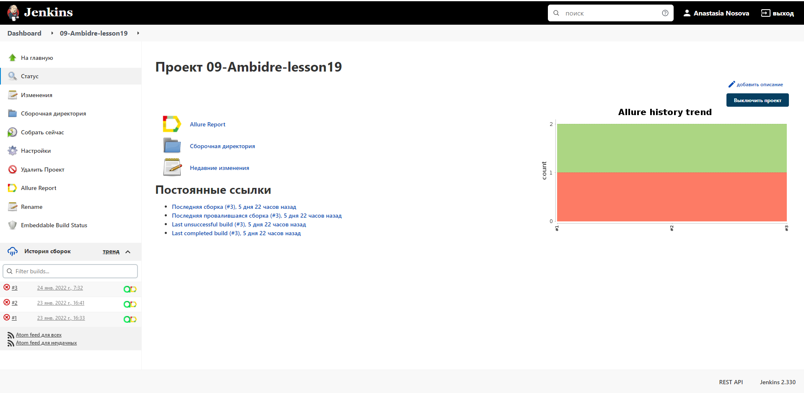
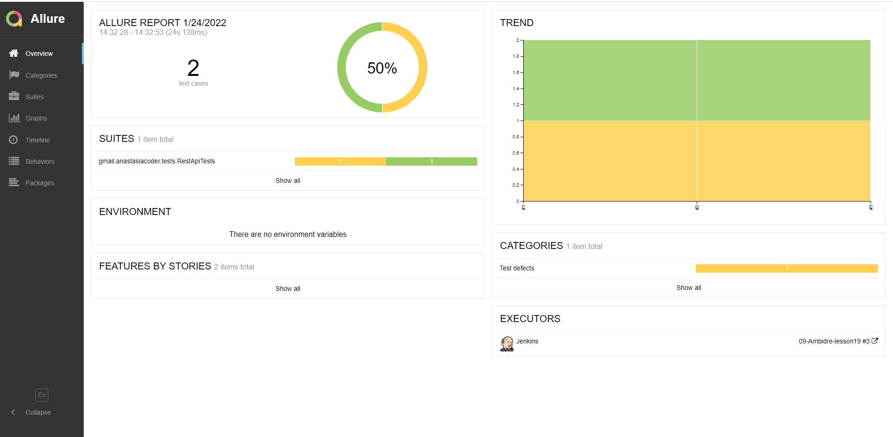
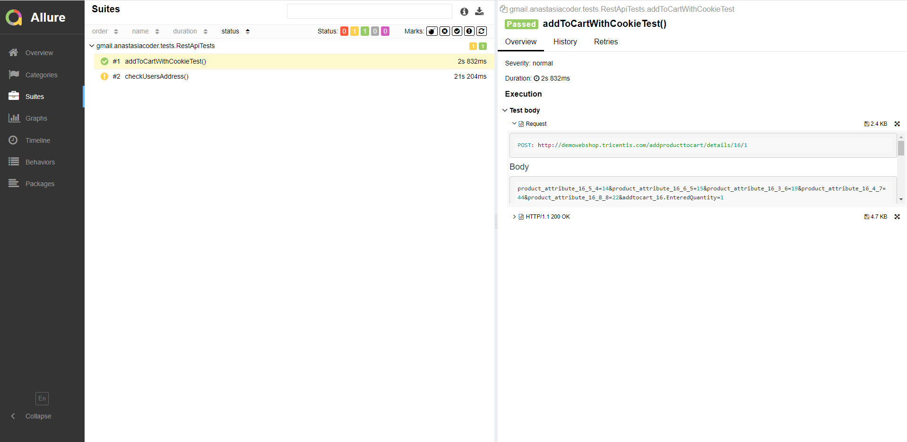
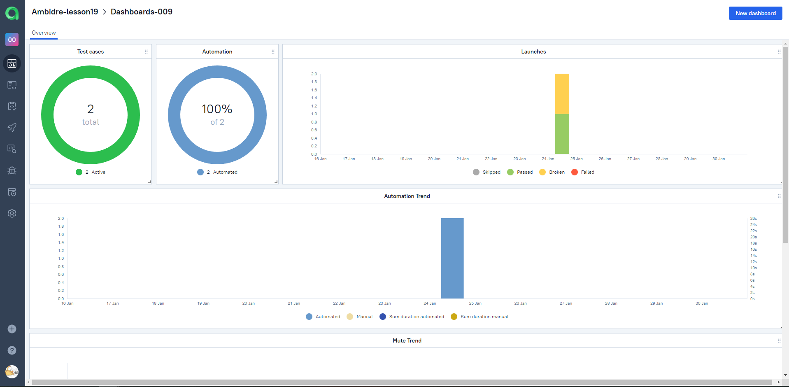
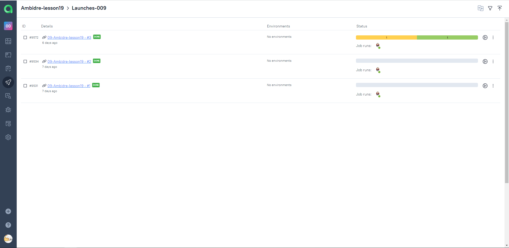
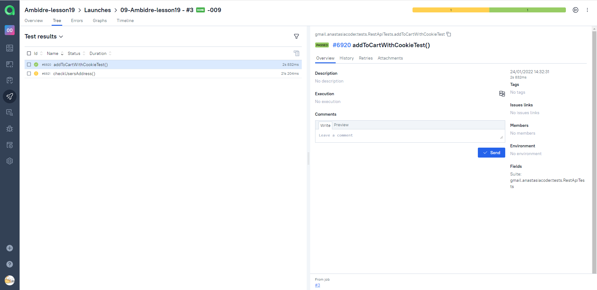

# Задание 19. API-автотесты для [Demo Web Shop](http://demowebshop.tricentis.com/) + Allure

## Покрытый функционал
> Разработаны автотесты на <code>API</code>.
1. Тест с использованием cookies, проверяющий добавление товара в корзину
2. Кейс с сочетанием API и UI: логинимся через API, получаем cookie. Устанавливаем cookie в браузер. Переходим в личный кабинет и проверяем данные пользователя.

## Технологический стек

<p align="center">


</p>

> В данном проекте автотесты написаны на <code>Java</code> с использованием фреймворка <code>Selenide</code> для UI-тестов и библиотеки <code>REST Assured</code> для API-тестов.
>
> <code>Allure Report</code> формирует отчет о запуске тестов.
>
> Для автоматизированной сборки проекта используется <code>Gradle</code>.
>
> В качестве библиотеки для модульного тестирования используется <code>JUnit 5</code>.
>
> <code>Jenkins</code> выполняет запуск тестов.
>
> Автотесты интегрируются с тест-менеджмент системой <code>Allure TestOps</code>.

## Запуск тестов из терминала
### Локальный запуск тестов

```
gradle clean test
```

##  Для запусков автотестов используется [Jenkins](https://jenkins.autotests.cloud/job/09-Ambidre-lesson19/)




##  Анализ результатов запусков в Jenkins через Allure Reports

### Главная страница Allure-отчета



### Группировка тестов по проверяемому функционалу



##  Интеграция тестов c тест-менеджмент системой [Allure TestOps](https://allure.autotests.cloud/project/918/)

### Основной дашборд



### Результаты запуска тестов



### Перечень тест-кейсов


